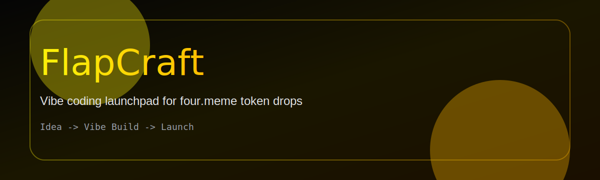

# 4craft

An AI-powered Dapp that helps users craft ideas fast, build with vibe coding tools, and launch tokens via four.meme.



**Updated Summary**
4craft streamlines the full flow: generate an idea, synthesize a contract, produce a frontend build prompt for vibe coding IDEs, and prepare a token launch on four.meme.

## Core Flow
The application operates on a three-stage pipeline: **Forge (Ideation)** -> **Oracle (Verification)** -> **Architect (Blueprinting)**.

### 1. Forge: Idea Generation
Users configure the Forge to generate project ideas:
- **Modes**:
  - **Targeted**: precise control over ecosystems and sectors.
  - **Chaos**: randomized, high-variance ideas.
- **Parameters**:
  - **Ecosystem**: BSC only.
  - **Sectors**: FOUR.MEME, DeFi, SocialFi, GameFi, Infra, DePin, NFT, DAO.
  - **Degen Level (0-100)**: tunes risk/innovation.
  - **AI Model**: ChatGPT-compatible model with structured JSON outputs.

### 2. Oracle: Verification
Verify idea uniqueness:
- **Collision Detection**: checks for similar protocols.
- **Pivot Suggestions**: proposes alternatives if collisions are found.

### 3. Architect: Blueprint + THE BUILDER
Blueprinting now includes a guided builder:
- **Contract Stage**: generates a full Solidity contract and provides a **Contract Deploy** action.
- **Frontend Stage**: generates a full Dapp build prompt for vibe coding IDEs (Claude Code, Codex, Antigravity, v0.app).
- **Deploy Stage**: auto-generates 4 logo options and pre-fills a four.meme token launch form (editable by users).

## Tech Stack
- **Frontend**: React 19 + Vite
- **Language**: TypeScript
- **Styling**: Tailwind CSS + custom cyber styles
- **AI Integration**: OpenAI-compatible Chat Completions
- **Wallet**: RainbowKit + wagmi (BSC only)
- **Icons**: Lucide React

## Getting Started
### Prerequisites
- Node.js (v18 or higher)
- An OpenAI-compatible API key

### Installation
1. Install deps
```bash
npm install
```

2. Configure environment
```env
OPENAI_BASE_URL=https://api.openai.com/v1/
OPENAI_MODEL=gpt-5.2-ca
OPENAI_API_KEY=sk-xxxx
```

3. Run locally
```bash
npm run dev
```

## Project Structure
- `App.tsx`: Main application controller
- `services/ai.ts`: AI prompt orchestration
- `types.ts`: TypeScript definitions
- `locales.ts`: Translation strings
- `components/`: UI components
- `index.html`: Global cyber styles